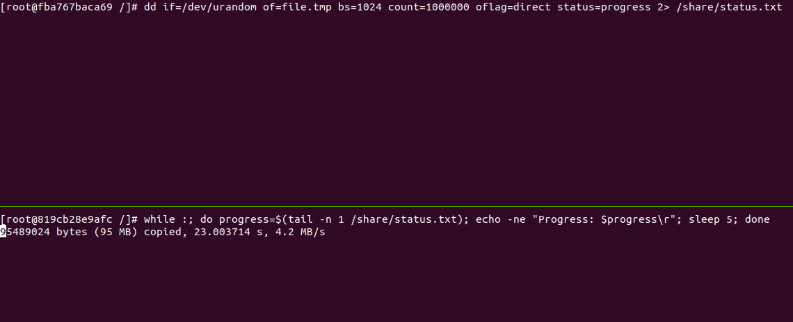

# commands

system

    # prepare
    docker pull centos:centos7
    docker volume create --name share
    docker volume ls
    docker run -it --name=container1 -v share:/share centos:centos7
    docker run -it --name=container2 -v share:/share centos:centos7

container1

    dd if=/dev/urandom of=file.tmp bs=1024 count=1000000 oflag=direct status=progress 2> /share/status.txt

container2

    while :
    do
        progress=$(tail -n 1 /share/status.txt)
        echo -ne "Progress: $progress\r"
        sleep 5
    done

# result

