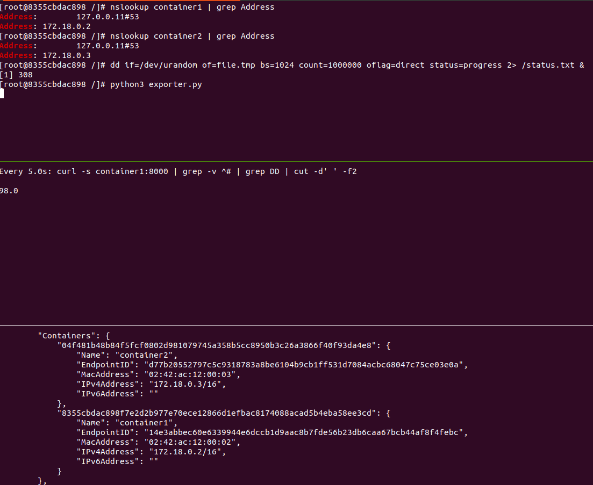

# commands

system

    # prepare
    docker pull centos:centos7
    docker run -it --name=container1 centos:centos7
    docker run -it --name=container2 centos:centos7

    # bridge containers
    docker network create container_net
    docker network list
    docker network connect container_net container1
    docker network connect container_net container2
    docker inspect container_net
    

container1

    # exporter deps
    yum install -y python3
    pip3 install prometheus-client

    # show
    yum install bind-utils
    nslookup container1 | grep Address
    nslookup container2 | grep Address

    dd if=/dev/urandom of=file.tmp bs=1024 count=1000000 oflag=direct status=progress 2> /status.txt &

    python3 exporter.py

container2

    watch -n 5 "curl -s container1:8000 | grep -v "^#" | grep DD | cut -d' ' -f2"

# result

