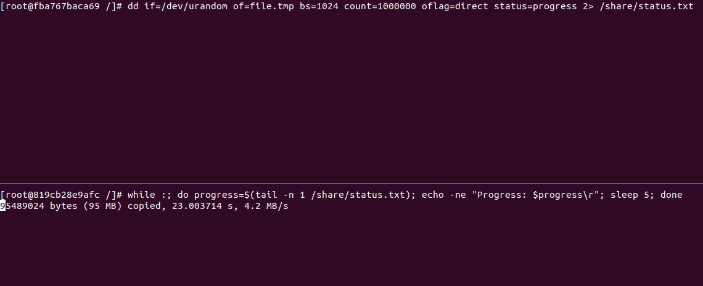
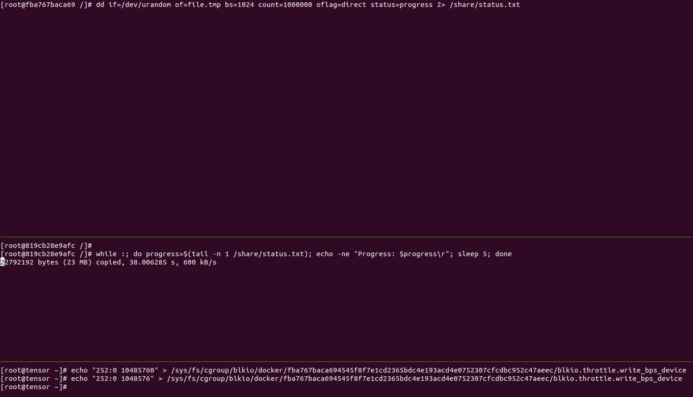

# commands

system

    # prepare
    docker pull centos:centos7
    docker volume create --name share
    docker volume ls
    docker run -it --name=container1 -v share:/share centos:centos7
    docker run -it --name=container2 -v share:/share centos:centos7

    # find container1 id
    docker ps

    # limit write_bps for first test
    echo "252:0 10485760" > /sys/fs/cgroup/blkio/docker/fba767baca694545f8f7e1cd2365bdc4e193acd4e0752307cfcdbc952c47aeec/blkio.throttle.write_bps_device

    # limit write_bps for for second test
    echo "252:0 1048576" > /sys/fs/cgroup/blkio/docker/fba767baca694545f8f7e1cd2365bdc4e193acd4e0752307cfcdbc952c47aeec/blkio.throttle.write_bps_device

    # also we can limit iops via blkio.throttle.write_iops_device

container1

    # find target device major and minor numbers (ex. 252 and 0)
    cat /proc/partitions

    dd if=/dev/urandom of=file.tmp bs=1024 count=1000000 oflag=direct status=progress 2> /share/status.txt

container2

    while :
    do
        progress=$(tail -n 1 /share/status.txt)
        echo -ne "Progress: $progress\r"
        sleep 5
    done

# result

## before 

## after

